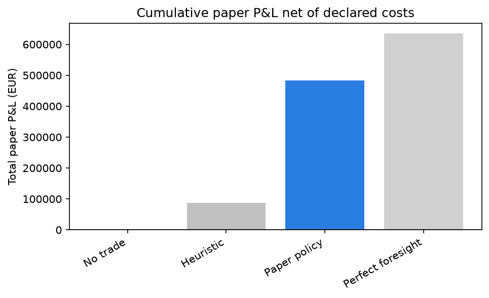

# nordic-power-market-risk

A decision and risk system for a small battery in the Swedish SE3 bidding zone. It
allocates energy and reserve capacity across day-ahead, imbalance, and reserve markets
(FCR/aFRR/mFRR), then settles every paper position against observed prices.

This is a historical decision demonstrator. It places no live orders.

## Headline result

On the 11-month walk-forward window (Apr 2025 to Feb 2026), the optimized policy earns
EUR 483,956 net of declared costs, against EUR 0 for no-trade and EUR 86,516 for the
heuristic benchmark. The reserve-capacity allocation (FCR/aFRR/mFRR) supplies the bulk of
the margin; the perfect-foresight bound of EUR 635,813 is a ceiling, not a target.



The figure renders from the walk-forward outputs through `nordic-risk figures`.

## Real data, real provenance

The data are public and real. Day-ahead prices come from ENTSO-E Transparency Platform and
Svenska kraftnät. Imbalance prices come from eSett. Weather comes from SMHI. Every source
carries a manifest with its licence, coverage window, endpoint, pull timestamp, and
checksum.

## Method in one line

A probabilistic day-ahead price forecast feeds a rolling mixed-integer linear program
(MILP) that dispatches the battery. A CVaR and drawdown gate blocks any decision that
breaches tail-risk limits.

## What this is and is not

This is a paper-trading backtest on observed public data. It places no live orders. It
simulates the control obligations of revised REMIT (EU 2024/1106) Article 5a rather than
discharging them. The report states this plainly.

## Read more

- [Technical report](docs/report.md): the full methodology, theory, regulation, and
  decision log.
- [Results notebook](notebooks/results.ipynb): reproduces the headline figures.

## Stack

Python 3.13, uv, typer, DuckDB, Pyomo + HiGHS, LightGBM, scikit-learn, MLflow, Pandera,
Evidently, matplotlib.

## Setup

```bash
uv sync
cp .env.example .env   # add your ENTSO-E API token
uv run nordic-risk --help
uv run nordic-risk ingest
```

## Development

```bash
uv run ruff check .    # lint
uv run mypy            # strict type checking
uv run pytest          # tests, coverage gated at 80%
docker build -t nordic-risk .   # multi-stage build, slim runtime image
```

CI (GitHub Actions) runs lint, typecheck, test, and a Docker build on every push and pull
request.
