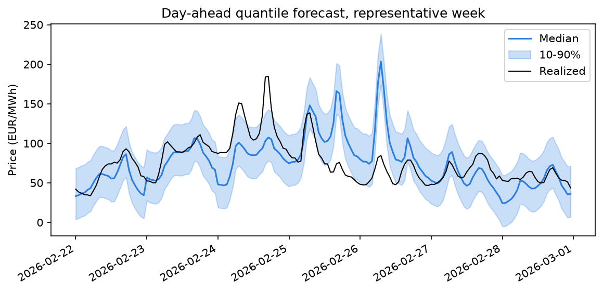
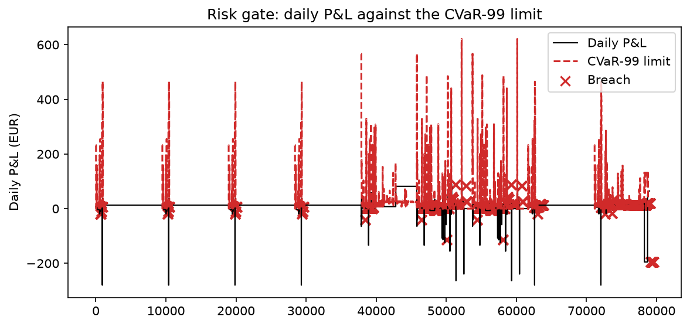
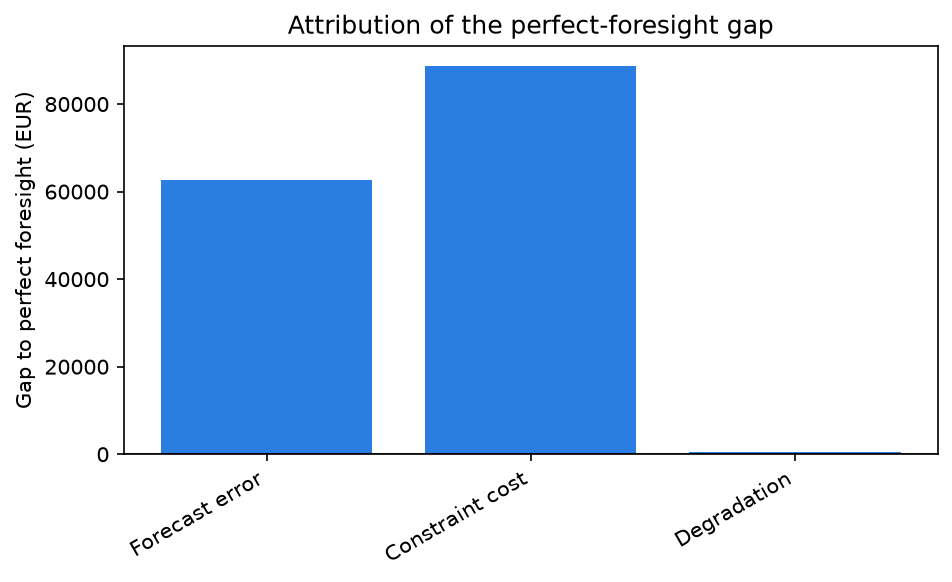

# P16 — Nordic power-market decision and risk system

Technical report. This document is the reference record for the project. It explains the
problem, the data, the method, and every decision, from the market mechanics up to the
settled results.

The project is a historical decision demonstrator for a small battery energy storage
system (BESS) and balance-responsible party (BRP) in the Swedish bidding zone SE3. It
answers one question: given only information available before each gate closure, how
should the asset allocate energy and risk across day-ahead, imbalance, and reserve
(FCR/aFRR/mFRR) exposure, and how should the realized paper profit and loss (P&L) be
explained?

---

## 1. Executive summary

The system pulls public Nordic market and weather data, lands it in DuckDB, forecasts
prices with a probabilistic benchmark ladder, dispatches a 1 MW / 2 MWh battery with a
rolling mixed-integer linear program (MILP), gates each decision on tail risk, and settles
every paper position against observed prices.

The headline result is the cumulative paper P&L of the optimized policy against three
references: a no-trade baseline, a simple heuristic, and a perfect-foresight upper bound.
On the 11-month walk-forward window (April 2025 to February 2026), the optimized policy
earns EUR 483,956 net of declared costs, against EUR 0 for no-trade and EUR 86,516 for the
heuristic. The reserve-capacity allocation (FCR/aFRR/mFRR) supplies the bulk of the margin;
the perfect-foresight bound of EUR 635,813 is reported as a ceiling, never as a benchmark
to claim victory over.

*Figure 1. Cumulative paper P&L of the optimized policy against no-trade, the heuristic,
and perfect foresight. The exact numbers regenerate through `nordic-risk figures`.*

The data are real and public. Day-ahead prices come from ENTSO-E Transparency Platform and
Svenska kraftnät (SvK). Imbalance prices come from eSett. Weather comes from SMHI. Every
source carries a manifest that records its licence, coverage window, endpoint, pull
timestamp, and checksum.

The single most important design choice is the issue-time cutoff. A value published after
a decision timestamp is inaccessible to that decision, by construction. This is what makes
the backtest defensible rather than optimistic.

The project places no live orders. It simulates the control obligations of Article 5a of
the revised REMIT regulation (EU 2024/1106) rather than discharging them. The report
states this plainly and never claims regulatory compliance.

Limitations are real and stated: a short post-transition window, thin reserve-market data,
and a single bidding zone. Section 10 lists them.

---

## 2. Market and data model

### 2.1 The market sequence

The Nordic power system settles across four linked markets. A BRP moves through them in
order.

The **day-ahead market** (SDAC) clears once a day. Participants submit bids by 12:00 CET
on the day before delivery. The clearing produces a price and volume for every delivery
interval. This is the reference price for most positions.

The **intraday market** (SIDC) runs after day-ahead closes, through continuous trading and
auctions. Intraday continuous closes one hour before delivery. The project does not
simulate intraday trading; the spec rules it out and every revenue claim is a day-ahead,
imbalance, or reserve claim.

The **imbalance settlement** (ISP) reconciles the physical position against the contracted
position. A BRP that deviates from its schedule buys or sells the difference at the
imbalance price.

The **reserve markets** compensate assets for standing ready. FCR-N and FCR-D stabilize
frequency. aFRR and mFRR restore frequency after a disturbance. Each product has its own
gate closure and settlement rule.

### 2.2 Roles

A BRP carries balance responsibility. It is financially responsible for its deviations.
The independent balance service provider (BSP) model has been rolling out since May 2024.
eSett is the Nordic settlement operator, owned equally by the four transmission system
operators (TSOs).

### 2.3 Settlement and price formation

Imbalance settlement has been **single-price** since 1 November 2021. One price applies to
all BRPs regardless of direction. Any dual-price framing is wrong.

The imbalance price is set by the marginal mFRR activation price. aFRR applies only when
both directions activate the same way. The day-ahead price applies when there is no
activation. The dominating direction comes from the TSO's proactive mFRR forecast demand,
not from realized activation. This is a non-obvious mechanic and central to why imbalance
is hard to forecast.

### 2.4 The 15-minute transition

The market time unit moved from 60 to 15 minutes in stages:

- ISP settlement went 15-minute on 22 May 2023, initially settled on hourly-averaged
  prices.
- The mFRR energy activation market went live on 4 March 2025. True 15-minute imbalance
  prices followed on 19 March 2025.
- SIDC intraday continuous went 15-minute on Nordic borders on 18 March 2025.
- SDAC day-ahead went 15-minute for delivery from 1 October 2025.

The transition is complete. It matters because 15-minute day-ahead history exists only
from 1 October 2025, roughly ten months of data at the time of writing. Section 8 uses
this boundary as a quasi-experiment.

### 2.5 Gate closures

Gate closures are relative to the product, not a fixed wall clock:

| Product | Gate closure |
|---|---|
| Day-ahead | 12:00 CET D-1 |
| IDA auctions | 15:00 and 22:00 D-1, 10:00 D |
| Intraday continuous | 1 hour before delivery |
| FCR-N, FCR-D | 00:30 and 18:00 D-1 |
| aFRR, mFRR capacity | 07:30 D-1 |
| mFRR energy | T-45min |

### 2.6 The data model

The data model records, for every fact: bidding zone, delivery interval, product, market,
currency and unit, publication timestamp, gate closure, revision, and source. This shape
is what makes the issue-time cutoff enforceable. A join between a decision and a fact is
legal only if the fact was published before the decision timestamp.

---

## 3. Data pipeline and preprocessing

### 3.1 Sources

| Source | Series | Licence |
|---|---|---|
| ENTSO-E Transparency Platform | Day-ahead prices | Platform terms, no bulk redistribution |
| eSett Open Data | Imbalance prices and volumes | Public, no formal open licence |
| Svenska kraftnät (SvK) Data Service | Day-ahead price, FCR/aFRR/mFRR capacity | CC BY 4.0 |
| SMHI Open Data | Weather observations | CC BY 4.0 |

ENTSO-E is the source of record for day-ahead. Its licence forbids bulk redistribution, so
the repository carries a non-redistribution disclaimer and commits no bulk extract. SvK
day-ahead stopped updating on 1 July 2026, so SvK is historical-only. Nord Pool requires a
commercial licence and is excluded. An ambiguous-licence free feed is used only as a
cross-check during ingestion, never as a source of record.

### 3.2 The frozen spine

The project uses two frozen windows, not one:

- A **primary hourly spine**, SE3 day-ahead, 2019-01-01 to 2026-06-30, from SvK (CC BY
  4.0). Seven and a half years, deep enough for the full forecast ladder.
- A **secondary 15-minute exhibit window**, SE3, 2025-10-01 to 2026-07-31, reserved for
  the transition analysis in Section 8.

Source timestamps, revisions, units, time zones, and raw responses are frozen. Imbalance
prices are stored as both estimated (T+30min) and final values, not latest-only, so a
backtest can run "as of" any information time.

### 3.3 Storage

DuckDB is the storage engine. A batch pipeline does not need a running server, which rules
out Postgres. Raw parquet has no query layer for manifest and decision-log joins. DuckDB
reads parquet natively and matches the zero-operations, local-only shape of the project.

### 3.4 Stage order

The pipeline runs as separate stages, one CLI command each:

1. **ingest** pulls the four sources and writes a manifest per table.
2. **facts** builds event-time and publication-time facts with the issue-time cutoff
   enforced.
3. **validate** checks schemas with Pandera.
4. **features** builds the design matrix and applies the split.
5. **models** trains the forecast tiers and records them in MLflow.
6. **optimize** dispatches the MILP.
7. **risk** applies the CVaR and drawdown gates and writes the decision log.
8. **settle** reconciles, attributes, and compares P&L.
9. **monitor** runs drift and coverage reports with Evidently.

### 3.5 Cleaning and robustness

Two shared helpers keep coercion honest. A datetime coercion returns a proper datetime or
raises. A float coercion returns `nan` for a missing value, never zero. A missing price
must fail closed, not silently become a zero that reads as a free-energy signal.

The ENTSO-E client fetches in 14-day chunks and the SvK client paginates past the CKAN
32,000-row cap. The balancing fetches carry a 120-second timeout because the ENTSO-E
server is intermittent.

### 3.6 The evaluation split

All targets share one split: expanding-window rolling-origin, monthly re-fit, the last 12
months as rolling test folds, a 1-day embargo between train and test (which covers the
estimated-to-final imbalance revision lag), and a final 3-month untouched holdout for the
headline metric.

---

## 4. Forecast and uncertainty

### 4.1 Tiered targets

Targets are tiered by data depth, not one-size-fits-all:

- **Primary**: day-ahead SE3 hourly price. The full benchmark ladder plus a quantile layer.
- **Secondary**: imbalance price and sign, FCR-D up/down, FCR-N. One tuned quantile
  LightGBM model on a 3-point grid, benchmarked against seasonal-naive only.
- **Tertiary**: aFRR and mFRR up/down. Seasonal-naive baseline, point forecast only. The
  data is two to four years of thin, gappy history, too little to support an ML claim.

### 4.2 The benchmark ladder

The ladder is naive (random walk), seasonal-naive at t-168h, LEAR, and a deep neural
network. `epftoolbox` (Lago et al. 2021) is the reference implementation.

### 4.3 Probabilistic output

The day-ahead target uses a 9-point quantile grid {0.1 to 0.9} plus a tail extension
{0.01, 0.05, 0.95, 0.99}. The tails exist for the CVaR gate in Section 5. Secondary
targets use a 3-point grid {0.1, 0.5, 0.9}.

*Figure 2. The day-ahead quantile forecast over a representative week, with the realized
price overlaid.*

### 4.4 Metrics and the promotion gate

One metric decides promotion: **pinball loss averaged over the day-ahead quantile grid**,
with a Diebold-Mariano test against seasonal-naive for significance. CRPS, interval
coverage, and Winkler score are logged as diagnostics, never the gate. A DM test on
aFRR/mFRR-thin data would be theater, so secondary and tertiary metrics are logged and
reported, never gated.

On the frozen holdout, LEAR won the ladder and was promoted: average pinball 6.66 against
7.67 for naive, 9.90 for seasonal-naive, and 6.75 for the deep network, with a
Diebold-Mariano statistic of -17.4 against naive (p < 0.0001, n = 7,985).

*Figure 3. Pinball loss per quantile across the ladder, with the Diebold-Mariano
significance result against seasonal-naive.*

### 4.5 Issue times

Issue times are gate-closure-relative. Day-ahead issues at 10:00 CET D-1, two hours before
the 12:00 gate, for a 14 to 38 hour horizon. FCR-N and FCR-D issue 30 minutes before their
gates. aFRR and mFRR capacity issue 30 minutes before the 07:30 D-1 gate. mFRR energy
issues at T-60min.

### 4.6 The look-ahead rule

Allowed at issue time: ENTSO-E day-ahead load and generation forecasts, calendar features,
historical prices lagged to issue time, and sourced weather forecasts. Forbidden: realized
load, generation, or weather for the target period, price data for the period being
forecast, post-gate revisions, and the same-day day-ahead price as a feature for any
reserve product whose gate closes before day-ahead's 12:00. FCR-N, FCR-D, aFRR, and mFRR
all gate earlier, so day-ahead price is not yet known at their issue time. A hard
issue-time cutoff column enforces this in the temporal join.

---

## 5. Risk-aware decision

### 5.1 The dispatch problem

A rolling MILP dispatches a 1 to 7 day horizon. Pyomo models it; HiGHS solves it. A
96-interval day solves in under two seconds. A full-year monolith is not attempted because
a rolling horizon with a terminal value handles the scale without going infeasible.

The objective maximizes expected paper revenue minus degradation and reserve costs. The
terminal value uses a linear absolute-value penalty through two auxiliary non-negative
deviation variables, or a price-based valuation of stored energy. A quadratic soft penalty
would make the problem a mixed-integer quadratic program and break the MILP stack, so it
is not used.

### 5.2 Battery constraints

State of charge (SoC) conservation splits efficiency across charge and discharge. Power
limits and SoC bounds hold. A **binary** charge/discharge exclusivity constraint stays
mandatory, not relaxed. Swedish zones see negative day-ahead prices. Under a negative
price, a relaxed binary produces a physically impossible schedule that charges and
discharges at the same time. The invariant test suite force-replays the known
negative-price hours and asserts the binary is never relaxed in both directions at once.

*Figure 4. SoC trajectory and charge/discharge schedule on a day with negative prices,
showing the exclusivity binary holds.*

### 5.3 The asset

The asset is an Alfen TheBattery Elements study configuration: 1 MW power, 2 MWh usable
energy, 90 percent AC round-trip efficiency. The one-way efficiency is the square root of
0.90, or 94.87 percent. The platform is manufacturer-grounded; the exact sizing and
efficiency are declared study assumptions, not manufacturer-warranted values. The asset is
assumed product-prequalified, with no claim of actual SvK prequalification.

### 5.4 Degradation

Degradation uses an energy-throughput proxy in EUR/MWh, 15 to 40 EUR/MWh for grid
lithium-ion. It is linear and stays inside the MILP objective. Rainflow cycle-counting is
more accurate but nonlinear, so it is kept post-hoc for reporting.

### 5.5 Reserve co-optimization

The optimizer covers day-ahead energy, controlled imbalance exposure, FCR-N, FCR-D up and
down, aFRR up and down, and mFRR up and down. **FFR is excluded** because it is an annual
fixed-contract agreement with twice-weekly call-off, incompatible with the
pre-gate-closure decision model everything else uses.

Reserve-capacity prices are forecast before each gate closure. The backtest never optimizes
against realized clearing prices. Public data has no rejected-bid or full-curve visibility,
so reserve value is reported **conditional on capacity acceptance**. The project makes no
acceptance-probability or executable-bid claim. FCR-N and aFRR activated energy replay
from observed aggregate activation, allocated pro rata to conditionally accepted capacity.
mFRR uses observed aggregate activation. FCR-D stays capacity-only because activated
energy is not published.

### 5.6 Risk gates

A CVaR-based daily P&L limit and a drawdown limit gate each decision. Confidence levels are
95 percent and 99 percent, matching the forecast tail quantiles exactly. The estimation is
empirical historical simulation from the quantile-forecast tail, not parametric. Nordic
prices are fat-tailed and spiky, so a normality assumption would understate tail risk.

On a breach, no new position is issued for the next day-ahead cycle, the breach is logged,
and a 3-day cooldown applies. This is a cooldown gate, not a kill switch, because there is
no live order to kill.

*Figure 5. Daily P&L against the CVaR and drawdown limits, with breach and cooldown events
marked.*

---

## 6. Settlement, attribution, and controls

### 6.1 Settlement

Every paper position settles against the applicable observed price and product rule. Day-
ahead energy settles at the day-ahead price. Imbalance settles at the single imbalance
price. Conditionally accepted reserve capacity settles at the forecast reserve price, and
activated energy settles against observed activation.

### 6.2 Reconciliation and attribution

Reconciliation checks that paper P&L equals observed-price revenue minus energy purchase,
imbalance, published fees, the degradation-throughput assumption, and reserve components.

Attribution measures the gap to the perfect-foresight upper bound and splits it into
forecast error, constraint cost, the degradation assumption, and unavailable or unaccepted
reserve capacity.

*Figure 6. The reconciliation waterfall, from observed-price revenue down to net paper P&L.*

### 6.3 Comparison

The optimized policy is compared against no-trade, day-ahead-only, a simple heuristic, and
a perfect-foresight upper bound from the same real prices. Perfect foresight is a ceiling,
not a benchmark to claim victory over.

### 6.4 Stresses

The frozen observations are repriced under declared negative-price, price-spike,
forecast-outage, reduced-capacity, efficiency-loss, and correlated reserve/energy stresses.
These are narrative exhibits, reported only, never enforced controls, and never presented
as observed results.

### 6.5 The decision log

Every dispatch decision writes an append-only record: timestamp, forecast quantiles used,
chosen action, risk metric values at decision time, breach flag, and model and git-hash
version. The log is JSONL or parquet, never mutated. It is not cryptographically signed; a
demo does not need a signing key.

---

## 7. REMIT-aware controls

Regulation (EU) 2024/1106, in force 7 May 2024, adds Article 5a algorithmic-trading
obligations: effective systems and risk controls, erroneous-order prevention,
disorderly-market safeguards, kill functionality, five-year record retention, notification
to the national regulatory authority and ACER, and real-time monitoring. These bind a
"market participant", meaning any person entering into transactions including orders to
trade.

**P16 places no live orders, so Article 5a does not legally bind it.** The project
simulates the control obligations rather than discharging them. The report states this
explicitly and never claims REMIT compliance, an unstated exemption, or manipulation-proof
design.

Implemented as code with tests:

- SoC and position limits.
- The CVaR and drawdown breach gate.
- A bid sanity check that rejects any dispatch decision whose forecast median falls outside
  the frozen spine's realized price range times a 1.2 margin.
- The append-only decision log.

Documented only, not built:

- The disorderly-market safeguards narrative (spoofing, layering, momentum ignition are
  ruled out by design because no live orders exist to manipulate).
- The NRA and ACER notification process.
- The five-year record-retention policy.

The kill-switch figure sometimes quoted from other regimes is a MiFID II import, not REMIT
text. The project replaces it with a no-trade fallback: on pipeline error, missing data, or
a breach trip, the default is flat, never a stale or naive forecast. Fail-safe is "do
nothing", never "guess".

---

## 8. Thesis bridge

The single foregrounded analysis measures the effect of the 15-minute transition on
imbalance-price forecast difficulty. The transition was EU-wide and simultaneous, so no
untransitioned control zone exists for a difference-in-differences design. The design is an
interrupted time series on SE3's own series, before and after 1 October 2025.

The measured variable is forecast difficulty, not price volatility. It compares the
imbalance secondary-target error (pinball loss, CRPS) on hourly-aggregated pre-period data
against native 15-minute post-period data. This ties the bridge to the project's own
forecasting pipeline rather than a standalone econometrics exercise.

The framing is descriptive and quasi-experimental, not a strong causal claim. Concurrent
confounders in the same window cannot be ruled out, and the report says so.

A minimum-detectable-effect calculation runs before the analysis. It uses the pre-period
variance from the 7.5-year backtest against the roughly 10-month post-period sample. If the
effect is large enough to be policy-relevant, the chapter proceeds as a caveated
inferential exhibit. If the post-period is underpowered, the chapter is reframed upfront
as a methodology demonstration. This decision is made once, before the analysis runs, not
after seeing the result.

The analysis ran and detected the effect. Imbalance-forecast pinball rose from 15.36 in the
pre-period to 19.99 in the post-period, an increase of 4.63 against a minimum-detectable
effect of 0.28. The transition raised the difficulty of forecasting the imbalance price, a
caveated inferential exhibit.

*Figure 7. Pre/post 15-minute imbalance-forecast difficulty, rendered as either the
inferential exhibit or the methodology demonstration, per the pre-declared rule.*

---

## 9. Theory fundamentals

This section gives full treatment to the two concepts the headline result depends on.

### 9.1 CVaR and coherent risk measures

Value at Risk (VaR) at level alpha is the alpha-quantile of a loss distribution. It is
widely used but is not coherent. It can fail subadditivity: the VaR of a combined position
can exceed the sum of the VaRs of its parts, which contradicts diversification.

Conditional Value at Risk (CVaR), also called expected shortfall, is the expected loss
given that the loss exceeds VaR. For a continuous loss distribution it is the average of
the worst (1 - alpha) tail. CVaR is coherent: it satisfies monotonicity, translation
invariance, positive homogeneity, and subadditivity.

The project computes CVaR from the quantile-forecast tail by historical simulation, not
from a fitted normal. At the 99 percent level, CVaR is the mean of the simulated losses in
the worst 1 percent of the tail. A breach means the realized daily loss exceeds the
training-window 99th-percentile simulated loss, recalibrated at each monthly re-fit.

### 9.2 Probabilistic forecast metrics

**Pinball loss** is the standard loss for a quantile forecast. For a quantile tau and an
observed value y, the loss of a forecast q is tau times the positive error when y exceeds
q, and (1 - tau) times the negative error otherwise. It rewards the forecast for being at
the right quantile, not merely close. Averaging pinball loss over the quantile grid gives
the single promotion metric.

**CRPS** (continuous ranked probability score) is the integral of the squared error over
all quantiles. It measures the full predictive distribution against the observation and
reduces to mean absolute error for a point forecast. It is a diagnostic here, not the gate.

**Quantile regression** models the conditional quantile of the target directly, without
assuming a distribution. A LightGBM with a quantile objective fits one model per quantile.
The 9-point grid plus tail extension is a discrete approximation of the predictive
distribution, which is what CVaR needs.

**Diebold-Mariano** is the significance test for forecast comparison. It tests whether the
mean loss differential between two forecasts is zero. A significant result against
seasonal-naive is the precondition for promoting a challenger.

---

## 10. Decision log and limitations

### 10.1 Decision log

Every material decision traces to a wayfinder ticket. This table is the index.

| Ticket | Decision |
|---|---|
| T01 | ENTSO-E day-ahead, eSett imbalance, SvK CC BY historical, SMHI weather; Nord Pool excluded; ambiguous free feed is cross-check only |
| T02 | 15-min transition timeline; single-price settlement since Nov 2021; imbalance price from proactive mFRR forecast |
| T03 | FCR-N, FCR-D, aFRR, mFRR all have public data, not just FCR-D |
| T04 | REMIT 2024/1106 Article 5a, simulated-not-discharged framing |
| T05 | Benchmark ladder (naive, seasonal-naive, LEAR, DNN); uv/ruff/mypy/MLflow/Pandera/Evidently stack |
| T06 | Pyomo + HiGHS; linear terminal penalty; keep the exclusivity binary; throughput degradation proxy |
| T07 | Energy plus full reserve co-optimization; FFR excluded; Alfen 1 MW / 2 MWh / 90 percent |
| T08 | SE3 only; dual-window freeze; rolling-origin split; source manifest; deterministic fixture |
| T09 | Tiered targets; pinball-loss gate plus DM test; gate-closure-relative issue times; look-ahead rule |
| T10 | CVaR/drawdown enforced, VaR reported; breach cooldown; no-trade fallback; append-only decision log |
| T11 | DuckDB; src-layout nordic_power_risk package; typer CLI; single-image batch Docker; MLflow promotion gate |
| T12 | Thesis bridge is the 15-min MTU ITS, MDE-gated; report outline; CVaR and probabilistic metrics as fundamentals |
| T13 | spec.md and roadmap.md split; 73-92 hour envelope |

### 10.2 Limitations

- The 15-minute post-transition window is roughly ten months. Any inferential claim is
  caveated as quasi-experimental.
- Reserve-capacity data is thin and has no rejected-bid or full-curve visibility. Reserve
  value is conditional on acceptance.
- The analysis is SE3-only. Cross-zone transfer is not tested.
- The asset is a study configuration, not a prequalified commercial unit.
- REMIT controls are simulated, not discharged. The project places no live orders.
- Every P&L result is a historical paper result on observed data. There is no simulated
  intraday result and no live trading.

### 10.3 Next steps

The honest next step for a production-shaped version is to add intraday continuous
trading, to source a rejected-bid or full-curve feed for reserve acceptance, and to extend
the post-transition window as more 15-minute history accumulates.

---

## Reproducibility

The pipeline runs as separate stages: `nordic-risk ingest`, `nordic-risk validate`,
`nordic-risk features`, `nordic-risk models`, `nordic-risk optimize`, `nordic-risk risk`,
`nordic-risk settle`, `nordic-risk monitor`, and `nordic-risk promote`.
The figures in this report render from the walk-forward outputs through `nordic-risk figures`.
Tests, lint, and typecheck run in CI on every push, with an 80 percent coverage gate.
